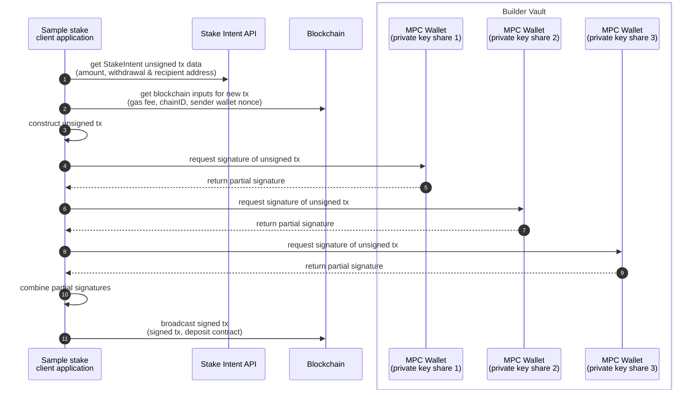

## Sample go staking app demo




<!--

# Get Plans
http -b GET https://svc.blockdaemon.com/boss/v1/plans \
  X-API-KEY:$STAKE_API_KEY \

# Post Intent
http -b POST https://svc.blockdaemon.com/boss/v1/ethereum/holesky/stake-intents \
  X-API-KEY:$STAKE_API_KEY \
  accept:application/json \
  content-type:application/json \
  stakes:='[{"amount":"32000000000","withdrawal_address":"0x00000000219ab540356cBB839Cbe05303d7705Fa","fee_recipient":"0x93247f2209abcacf57b75a51dafae777f9dd38bc"}]'

# Get Intents
http -b GET https://svc.blockdaemon.com/boss/v1/stake-intents?protocols=ethereum&networks=holesky \
  X-API-KEY:$STAKE_API_KEY 
```

sequenceDiagram
    autonumber
    participant StakeClient as Sample stake<br> client application
    participant StakeAPI as Stake Intent API
    participant Blockchain as Blockchain
    participant TSM as Sender Wallet Vault<br>(private key)

    StakeClient ->> StakeAPI: get StakeIntent unsigned tx data <br>(amount, withdrawal & recipient address)
    StakeClient ->> Blockchain: get blockchain inputs for new tx<br>(gas fee, chainID, sender wallet nonce)
    StakeClient ->> StakeClient: construct unsigned tx
    StakeClient ->> TSM: request signature of unsigned tx
    TSM ->> StakeClient: return tx signature
    StakeClient ->> Blockchain: broadcast signed tx<br>(signed tx, deposit contract)
--!>