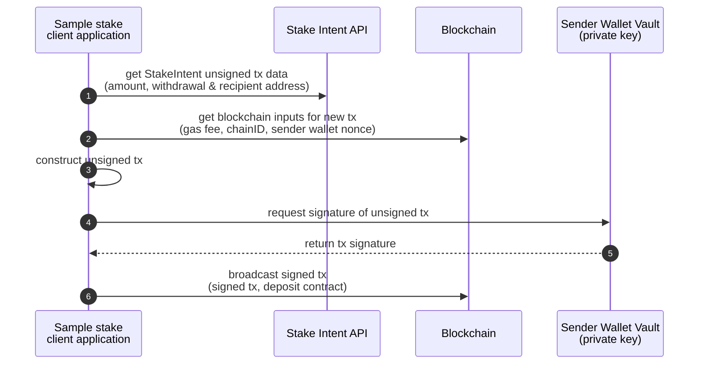

## Sample go staking app demo





<!--
 - ToDo:
     - use AWS Builder Vault environment (remove all code needed for mTLS with BDApp Builder Vault)

# Get Plans
http -b GET https://svc.blockdaemon.com/boss/v1/plans?protocols=ethereum&networks=holesky \
  X-API-KEY:$XAPIKEY \
  X-Client-ID:demo-organization

# Post Intent
http -b POST https://svc.blockdaemon.com/boss/v1/ethereum/holesky/stake-intents \
  X-API-KEY:$XAPIKEY \
  accept:application/json \
  content-type:application/json \
  stakes:='[{"amount":"32000000000","withdrawal_address":"0x00000000219ab540356cBB839Cbe05303d7705Fa","fee_recipient":"0x93247f2209abcacf57b75a51dafae777f9dd38bc"}]'

# Get Intents
http GET https://svc.blockdaemon.com/boss/v1/stake-intents?protocols=ethereum&networks=holesky \
  X-API-KEY:$XAPIKEY 
```
--!>