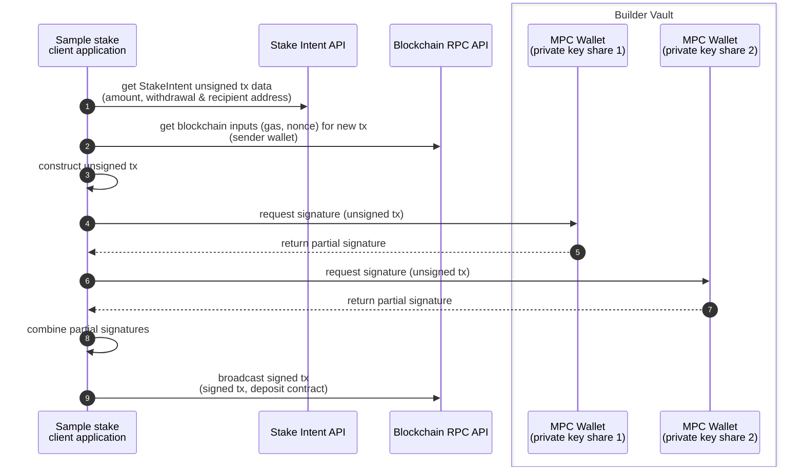

# Golang Ethereum staking with Builder Vault wallet




### Prerequisites
  - [Golang](https://go.dev/doc/install) or launch in [code-spaces](https://codespaces.new/Blockdaemon/demo-buildervault-stakingAPI?quickstart=1)
  - Register for a demo Builder Vault tenant: https://www.blockdaemon.com/get-started/builder-vault-sandbox-registration
    - Download SDK bundle provided in registration email (extract authentication certificates)
    - Place Builder Vault authentication certificate key-pair `client.crt` & `client.key` in this nodejs folder
  - Register for free Blockdaemon [RPC API key](https://docs.blockdaemon.com/reference/get-started-rpc#step-1-sign-up-for-an-api-key) and set in .env as BLOCKDAEMON_API_KEY
  - Register for free Blockdaemon [Staking API key](https://docs.blockdaemon.com/reference/get-started-staking-api#step-1-sign-up-for-an-api-key) and set in .env as BLOCKDAEMON_STAKE_API_KEY

### Step 1. Set environment variables in .env
```shell
cd ethereum-staking/buildervault/golang/
cp .env.example .env
```
- update .env with API keys

### Step 2. Launch main.go to auto-create the Builder Vault wallet address on first run
```shell
go run main.go
```
- note, on first run this step will fail as the wallet address has no funds
- copy the new Ethereum wallet address and fund the account

### Step 3. Fund the new Ethereum wallet address with 33 ETH using faucets below
  - https://holesky-faucet.pk910.de/#/

### Step 4. Launch main.go to generate the Stake Intent request, sign the request with BuilderVault and broadcast the transaction
```shell
go run main.go
```
- (optional) decode the raw signed transaction to inspect the Blockdaemon provided attributes (https://rawtxdecode.in)
- observe the confirmed transaction through the generated blockexplorer link
