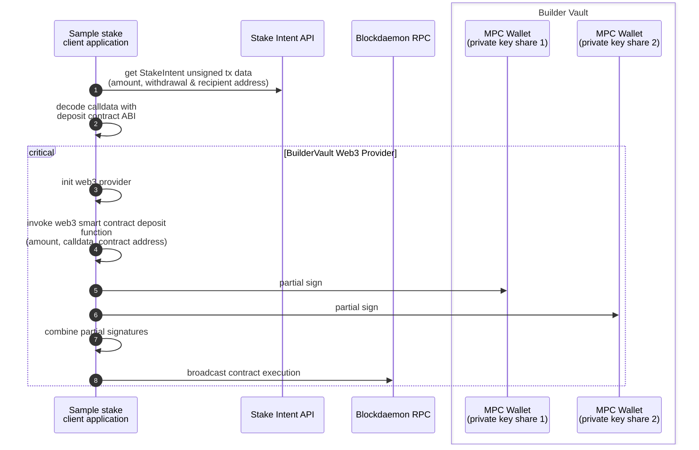

# TypeScript Ethereum staking with BuilderVault wallet



### Prerequisites
  - [Node.js](https://nodejs.org/en/download/package-manager) or launch in [code-spaces](https://codespaces.new/Blockdaemon/demo-buildervault-stakingAPI?quickstart=1)
  - Register for a demo Builder Vault tenant: https://www.blockdaemon.com/get-started/builder-vault-sandbox-registration
    - Download SDK bundle provided in registration email (extract authentication certificates)
    - Execute the go sample `go run main.go keygen` to generate an ECDSA master key ID across the 3 MPC players of the BuilderVault. This Master Key ID will be used to generate wallet addresses and sign operations.
    - Place Builder Vault authentication certificate key-pair `client.crt` & `client.key` in this nodejs folder
  - Register for free Blockdaemon [RPC API key](https://docs.blockdaemon.com/reference/get-started-rpc#step-1-sign-up-for-an-api-key) and set in .env as BLOCKDAEMON_API_KEY
  - Register a free Blockdaemon [Staking API key](https://docs.blockdaemon.com/reference/get-started-staking-api#step-1-sign-up-for-an-api-key) and set in .env as BLOCKDAEMON_STAKE_API_KEY

### Step 1. Set environment variables in .env
```shell
cd ethereum-staking/buildervault/nodejs-web3provider/
cp .env.example .env
```
- update .env with API keys and BuilderVault Vault details

### Step 2. Install package dependancies
```shell
npm config set @sepior:registry=https://gitlab.com/api/v4/projects/56306653/packages/npm/   # Builder Vault nodejsSDK public repository
npm config set @blockdaemon:registry=https://npm.pkg.github.com/
npm install @blockdaemon/buildervault-web3-provider
```

### Step 3. Launch ethereum-stake-bv.ts to determine the BuilderVault wallet address
```shell
ts-node ethereum-stake-bv.ts
```
- if needed, copy the new Ethereum wallet address and fund the account with https://holesky-faucet.pk910.de/#/

### Step 4. Re-launch ethereum-stake-bv.ts to generate the Stake Intent request, execute the contract with BuilderVault, and broadcast the transaction
```shell
ts-node ethereum-stake-bv.ts
```
- observe the confirmed transaction through the generated blockexplorer link
