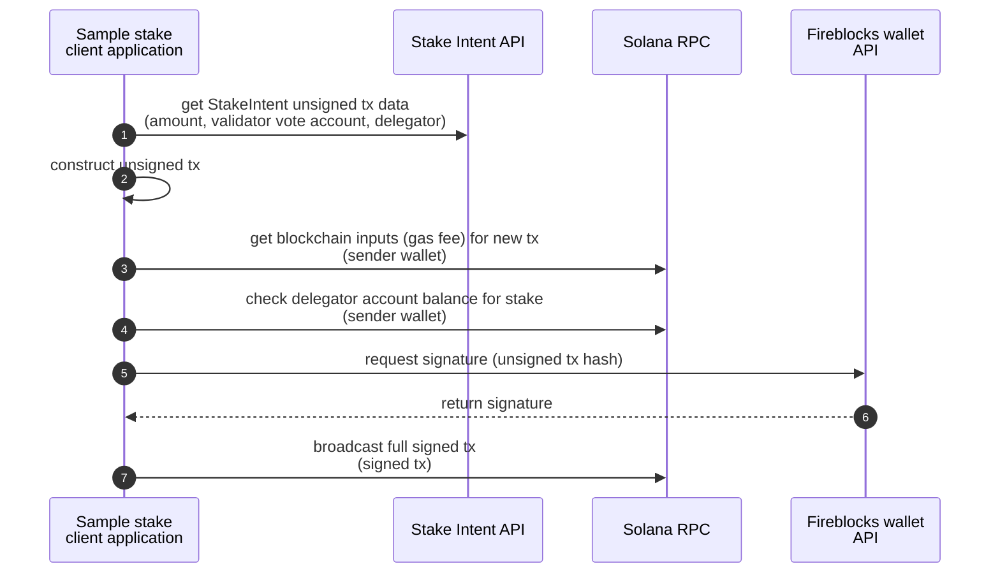

# TypeScript Solana staking with Fireblocks wallet



### Prerequisites
  - [Node.js](https://nodejs.org/en/download/package-manager) or launch in [code-spaces](https://codespaces.new/Blockdaemon/demo-buildervault-stakingAPI?quickstart=1)
  - Create Fireblocks [API and Secret key](https://developers.fireblocks.com/docs/manage-api-keys) for use with the [Fireblocks TypeScript SDK](https://github.com/fireblocks/ts-sdk)
  - Register free Blockdaemon [RPC API key](https://docs.blockdaemon.com/reference/get-started-rpc#step-1-sign-up-for-an-api-key) and set in .env as BLOCKDAEMON_API_KEY
  - Register free Blockdaemon [Staking API key](https://docs.blockdaemon.com/reference/get-started-staking-api#step-1-sign-up-for-an-api-key) and set in .env as BLOCKDAEMON_STAKE_API_KEY


### Step 1. Set environment variables in .env
```shell
cd solana-staking/fireblocks/nodejs/
cp .env.example .env
```
- update .env with API keys, Fireblocks Vault ID

### Step 2. Install package dependancies
```shell
npm install
```

### Step 3. Launch solana-stake-fb.ts to generate the Stake Intent request, sign the request with Fireblocks and broadcast the transaction
```shell
npm run start solana-stake-fb.ts
```
- [optional] view the signed transaction contents with inspector: https://explorer.solana.com/tx/inspector
- observe the confirmed transaction through the generated blockexplorer link
